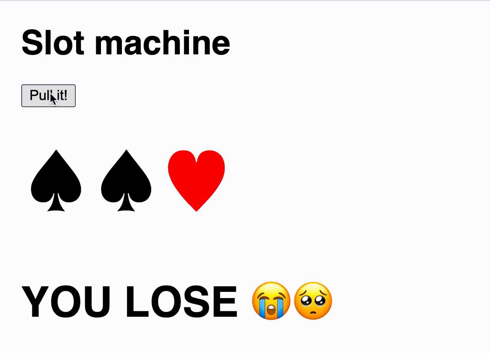

# DEV-II-WC-I-starter
*english below*

## Opgave
Je eerste opdracht is het maken van een interactieve slotmachine. Je zal ervoor moeten zorgen dat 3 random tekens gekozen worden bij het drukken op de knop, waarna je controleert of de drie tekens dezelfde zijn. Indien dit het geval is, geef je weer aan de gebruiker dat deze gewonnen is, indien niet geef je weer dat het spel verloren is.
Probeer eerst conceptueel na te gaan welke functies met elkaar zullen communiceren en wat de beste manier is om aan de opdracht te beginnen.
Je zal gebruik moeten maken van alle aangereikte functies.

## Lexicon
| woord | betekenis |
| --- | --- |
| lever | de arm waaraan je normaal zou trekken om het spel te starten, hier vervangen door een knop |
| reset | begin opniew |
| slot | een van de drie "kolomen" waarin een teken zichtbaar is |

## Aangereikte content

| positie | string |
| :--- | :--- |
| Weergeven van een symbol in de reel | `♥` |
| Tekst indien gewonnen | "YOU WIN 🎉💰" |
| Tekst indien verloren | "YOU LOSE 😭🥺" |

# English

## Challenge
Your first challenge is to create an interactive slot machine (one armed bandit). You will have to make sure three random symbols are chosen when the button is pressed, after which you check if the three symbols are the same.
If this is the case, you display the "you win" string found below, if the player lost, you change it by the other string.
Try first to conceptually think about which functions will have to interact with each other, and what the best starting point of this challenge might be.
You will have to use all the provided functions.

## Lexicon
| word | meaning |
| --- | --- |
| lever | The arm you need to pull to start the game, replaced with a button in this excersise |
| slot | One of the three "columns" that contains a symbol |
| reel | the three slots |

## Provided content

| position | string |
| :--- | :--- |
| HTML string to display a symbol in the reel | `♥` |
| Text when the player has won | "YOU WIN 🎉💰" |
| Text if the player lost | "YOU LOSE 😭🥺" |

